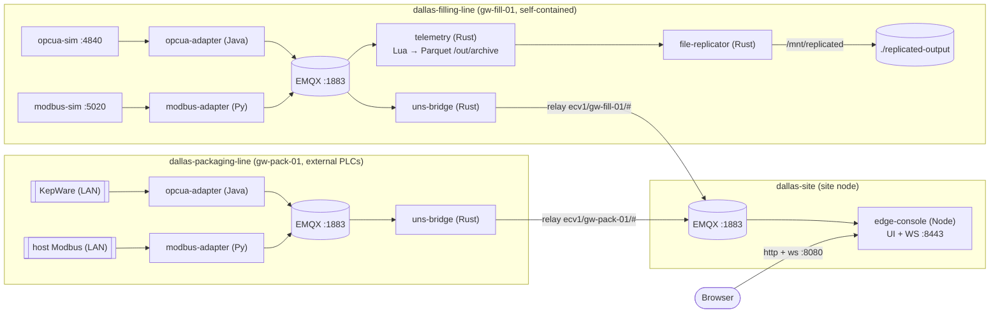

# EdgeCommons UNS — bottling-company E2E harness (one container per edge device)

A `docker compose` harness that stands up the whole EdgeCommons Unified Namespace (UNS) stack
for a fictional **beverage bottling plant** at site **`dallas`** — field sims → protocol
adapters → telemetry processing (Lua transform → Parquet) → file replication → per-line UNS
bridges → site broker → **edge-console** in the browser (Java · Python · Rust · TypeScript).

It is the canonical system-test harness for the EdgeCommons org. It supersedes the older
`../system-test/` layout by keeping the same scenario and proven build machinery while making
the runtime topology match a real edge deployment more closely: one container per device.

It is a **restructuring of `../system-test/`**: same scenario, same proven build machinery and
configs, but the topology is collapsed so that **one container = one edge device**, with every
edgecommons component running as a **supervised process** inside it (bare-metal style), against a
**per-device EMQX broker** baked into the image.

> This repo is meant to be cloned under the EdgeCommons umbrella workspace, as a sibling of
> `core/`, `edge-console/`, `opcua-adapter/`, `modbus-adapter/`, `telemetry-processor/`,
> `file-replicator/`, and `uns-bridge/`. The images COPY from those sibling repos at build
> time and use the unpublished local `core` checkout, so the Docker build exercises exactly
> the code in your workspace rather than pulling packages from a registry.

---

## The container model — one device, many supervised processes

`system-test/` ran ~13 containers (one per component + one per broker + one per sim). This
harness runs **3 containers**, one per physical edge device. Inside each, **supervisord** is
PID 1 and runs the device's processes — its own EMQX broker plus the edgecommons components —
gating each component on its local broker becoming ready. This mirrors how these components
actually deploy on a real gateway (several processes on one box, one local broker), and makes
the whole plant a handful of `docker logs <device>` streams.



Every arrow WITHIN a device box is a loopback (`localhost`) hop inside one container; only the
bridges cross the container boundary (each line’s bridge → the site node’s EMQX).

### The three containers

| Container (= device) | Thing | Supervised processes (start order) | Field sources |
|---|---|---|---|
| **`dallas-site`** | `dallas-console` | `emqx` → `edge-console` | — |
| **`dallas-filling-line`** | `gw-fill-01` | `emqx` → `opcua-sim` + `modbus-sim` → `opcua-adapter` + `modbus-adapter` → `telemetry-processor` → `file-replicator` → `uns-bridge` | **in-container sims** (self-contained) |
| **`dallas-packaging-line`** | `gw-pack-01` | `emqx` → `opcua-adapter` + `modbus-adapter` → `uns-bridge` | **external LAN PLCs** (KepWare + host Modbus) |

**Same image, different conf.** Both line devices run the **one** `edge-node` image; they differ
only by the bind-mounted supervisord conf + configs. The packaging line simply **does not start**
the field sims, the telemetry processor, or the file-replicator — its `packaging-line.conf` omits
those `[program:*]` blocks and its adapters point at the external endpoints instead of localhost.

### Startup ordering & readiness gating

supervisord’s `priority=` sets **start order** only; it does not wait for readiness. Readiness is
supplied by a tiny baked `wait-for-tcp` wrapper (uses bash `/dev/tcp`, no netcat): each component
is launched as `wait-for-tcp <host:port …> -- <real command>`, so it blocks until its
dependencies accept TCP, then `exec`s the real process. `autorestart=true` covers the rest.

- **EMQX** starts first (`priority=10`), `startsecs=10` so supervisord considers it "running"
  only after it has stayed up ~10 s.
- **Filling line**: sims (`priority=20`) have no gate; the adapters (`30`) wait on
  `localhost:1883` **and** their sim (`:4840` / `:5020`); telemetry (`40`), file-replicator (`50`)
  and the bridge (`60`) wait on `localhost:1883`.
- **Packaging line**: the adapters (`30`) render their config template from the external-endpoint
  env knobs, then wait on `localhost:1883`; the bridge (`60`) waits on `localhost:1883`.
- **Bridges intentionally do NOT wait on the site broker** — the `uns-bridge` retries its
  `siteBroker` (`dallas-site:1883`) connection on its own, so a line device comes up even if the
  site node is still booting.

---

## Images (DRY)

Two images, both multi-stage, both built with **context = the edgecommons umbrella root**
(`build.context: ../../..`) so they can COPY the unpublished sibling `core/libs/*` next to
each component — using the same local-sibling build pattern proven in `system-test/`, including the Rust `[patch]`
(`cargo-sibling-patch.toml`) and the `.dockerignore` fixes (below).

### `edge-node` (both line devices) — `dockerfiles/edge-node.Dockerfile`

- **Stage 1 (Java):** `maven:3.9-eclipse-temurin-25` — `mvn install` the sibling edgecommons Java
  lib into `~/.m2`, then package the shaded **OPC UA adapter** jar against it.
- **Stage 2 (Rust):** `rust:1-bookworm` — copy the sibling `core/libs/rust` +
  `rust-streamlog` next to each crate, drop the `[patch]` into each crate's
  `.cargo/config.toml`, and build **telemetry-processor**
  (`standalone,streaming,streaming-file-parquet,scripting-lua`), **file-replicator**
  (`standalone`), and **uns-bridge** (default). No kafka/kinesis/greengrass → no heavy C builds.
- **Stage 3 (runtime):** `eclipse-temurin:25-jre-noble` — gives the JRE for free. Adds a Python
  **venv** (`/opt/pyenv`) with the sibling edgecommons Python lib + `pymodbus` + `asyncua` (serves
  the Modbus adapter **and** both sims), plus **EMQX** (official apt repo), **supervisord**,
  `bash`, and the copied Rust binaries, OPC UA jar, Modbus adapter source, both **sim scripts**,
  and the `wait-for-tcp` / template-render helpers.
- **glibc note:** the Rust binaries are built on Debian Bookworm (glibc 2.36); the Noble runtime
  base (glibc 2.39) runs them fine (newer runtime glibc runs older-built binaries). Do **not**
  swap the runtime base to a jammy/2.35 image or the binaries won't load.
- **OPC UA sim simplification:** because the sim and the adapter now share ONE container, the
  adapter reaches the sim over loopback (`opc.tcp://localhost:4840`). The cross-container
  endpoint-rewrite `system-test` needed (rewriting `localhost:4840` → the sim service name) is
  **gone** — the sim script is copied verbatim.

### `site` (site node) — `dockerfiles/site.Dockerfile`

- **Stage 1 (Node):** `node:22` — build the edgecommons TS lib dist (dropping in the type-only
  `@edgecommons/streamlog-node` **stub** after `npm install`, before `tsc`, so the never-used
  streaming import resolves), then `link:lib` + build edge-console (protocol → server → ui/dist).
- **Stage 2 (runtime):** `node:22-slim` — add **EMQX** (apt repo) + supervisord + `wait-for-tcp`,
  copy the whole `/build` tree so `edge-console/` and `edgecommons/` stay siblings, and serve
  `ui/dist` from the Node server (`component.global.console.ws.webRoot`) — **no nginx/Vite**.

### Build context & `.dockerignore`

BuildKit resolves the ignore file as `<dockerfile>.dockerignore` first, so an identical copy of
`.dockerignore` ships next to each Dockerfile
(`dockerfiles/{edge-node,site}.Dockerfile.dockerignore`, generated from the canonical
`.dockerignore`). That keeps the multi-GB `target/ node_modules/ dist/ .git/` trees — and the
sibling `system-test/` (with its committed Parquet fixtures) — out of the context **without**
writing into the umbrella root, while re-including the TS lib's `src/**/target/` **source** dirs
(`!**/src/**/target/`) that the console build needs.

### EMQX everywhere

Every broker is EMQX (the user's call — homogeneous brokers), installed into the images from the
official apt repo and run under supervisord as `emqx foreground` (as the `emqx` user the deb
creates, `EMQX_ALLOW_ANONYMOUS=true`, plaintext `:1883`). The version is pinned via a Dockerfile
`ARG EMQX_VERSION=5.8.2`; some packagecloud repos append a distro suffix to the version string —
if the build can't find `emqx=5.8.2`, run `apt-cache madison emqx` in the repo and set
`--build-arg EMQX_VERSION=<string>`, or drop the pin to take the latest 5.x.

---

## Fresh setup

Clone this repo under the EdgeCommons org workspace:

```bash
cd ~/source/edgecommons
git clone git@github.com:edgecommons/bottling-company-test.git
```

Make sure the sibling repos are checked out beside it:

```text
edgecommons/
  core/
  edge-console/
  file-replicator/
  modbus-adapter/
  opcua-adapter/
  telemetry-processor/
  uns-bridge/
  bottling-company-test/
```

During the hard-cut rebrand, all sibling repos should be on `chore/edgecommons-rebrand`.
After that work merges, use the normal integration branch or `main` for all siblings.

Create a local environment file when you need to override ports or packaging-line endpoints:

```bash
cd bottling-company-test
cp .env.example .env
```

Do not commit `.env`; it is intentionally ignored. The filling line and site node run with
the built-in defaults. The packaging line needs reachable external PLC endpoints and a real
KepWare password in `.env`.

## Prerequisites

1. **Docker Desktop** (Compose v2.20+ for `include:`; BuildKit). Tested-config authored against
   Docker 28 / Compose v2.38.
2. **Sibling repos on compatible branches** (built against the local siblings — nothing pulled
   from a registry): `core`, `opcua-adapter`, `modbus-adapter`, `telemetry-processor`,
   `file-replicator`, `uns-bridge`, and `edge-console`. During the rebrand, use
   `chore/edgecommons-rebrand` across all siblings.
3. **Packaging line only:** LAN reachability to KepWare `192.168.1.180:49320` and the host Modbus
   sim `192.168.1.224:5020`. Not needed for the filling line or the site node.

---

## Run it

```bash
cp .env.example .env                 # optional; compose has built-in ${VAR:-default}s

# Whole plant (site + both line devices). The filling line is fully self-contained (no LAN);
# the packaging line needs LAN reachability to KepWare + the host Modbus sim.
docker compose up -d --build
docker compose logs -f               # first build is long (Java + Rust + the TS/Carbon UI)
```

Open the console: **http://localhost:8080** (self-served by `edge-console`).

Per-device logs (each device is one stream carrying all its processes):

```bash
docker compose logs -f dallas-filling-line
docker compose logs -f dallas-packaging-line
docker compose logs -f dallas-site
```

> **Filling line only?** Because the packaging line needs the LAN, you can start just the site +
> filling line by naming them: `docker compose up -d --build dallas-site dallas-filling-line`.

### What to watch in the console

1. **Overview** — `gw-fill-01` with `opcua-adapter`, `modbus-adapter`, `telemetry-processor`,
   `file-replicator`, `uns-bridge`; `gw-pack-01` with its two adapters + bridge; `dallas-console`
   is the console itself. All FRESH (5 s keepalive).
2. **Data** — `.../opcua-adapter/filler1/data/{Sine1,Counter}`,
   `.../modbus-adapter/conveyor1/data/{BottleCount,ProductTemp,FillLevel}`, and the processor's
   `.../telemetry-processor/main/data/downsampled`.
3. **Events / Metrics** — adapter connect/write events; adapter + processor + bridge metrics.
4. **Failure modes** — `docker stop dallas-filling-line` → all of `gw-fill-01` goes UNREACHABLE
   (site-broker LWT from the bridge); `docker start` → recovery. (In the collapsed model,
   stopping the whole device takes the bridge with it — the same LWT-driven offline signal.)

### Inspect the pipeline output

```bash
# Parquet the telemetry Lua→file sink wrote (inside the filling-line container):
docker compose exec dallas-filling-line ls -R /out/archive

# The replicated copies file-replicator produced (bind-mounted to the host):
ls -R replicated-output/            # dt=YYYY-MM-DD/hr=HH/part-*.parquet

# Peek at the transformed columns (device,signal,unit,rawValue,engValue,rate,alarm,…):
python -c "import pandas as pd,glob; f=sorted(glob.glob('replicated-output/**/*.parquet',recursive=True))[-1]; print(pd.read_parquet(f).head(20))"
```

`file-replicator` only picks up finalized `part-*.parquet` (in-progress files carry
`.inprogress`), verifies each by checksum, replicates it to `/mnt/replicated`
(= `./replicated-output`), then moves the source to `/out/_archived` so it isn't re-sent. Unlike
`system-test` (which shared `/out` via a named volume between two containers), here telemetry and
file-replicator share `/out` as a plain in-container directory — same device, same filesystem.

### `.env` knobs

| Var | Default | Meaning |
|---|---|---|
| `CONSOLE_PORT` | `8080` | edge-console UI + WS (host → site container `:8443`) |
| `SITE_BROKER_PORT` | `18830` | site EMQX `:1883` published for MQTTX/debug |
| `FILL_BROKER_PORT` | `18831` | filling-line EMQX `:1883` published |
| `PACK_BROKER_PORT` | `18832` | packaging-line EMQX `:1883` published |
| `SITE_DASHBOARD_PORT` | `18084` | site EMQX dashboard (remapped off 18083 — `edgecommons-emqx` uses 18083) |
| `KEPWARE_ENDPOINT` | `opc.tcp://192.168.1.180:49320` | packaging OPC UA endpoint |
| `KEPWARE_USER` / `KEPWARE_PASS` | `testuser` / `CHANGE_ME` | KepWare credentials. Set a real password in local `.env` before starting the packaging line. |
| `HOST_MODBUS` | `192.168.1.224:5020` | packaging host Modbus `host:port` (split into the template's host + port) |

On Docker Desktop, containers reach LAN IPs via the host NAT; if a packaging source runs **on
this machine**, set `KEPWARE_ENDPOINT` / `HOST_MODBUS` to `host.docker.internal:<port>` (the
packaging service declares `host.docker.internal:host-gateway`).

### Teardown

```bash
docker compose down
rm -rf replicated-output/*            # keep .gitkeep
```

---

## Structure & how to extend it

```
bottling-company-test/
  docker-compose.yml              # top-level: include: sites/dallas-site/... (+ chantilly + cloud notes)
  .env / .env.example
  .dockerignore                   # canonical; copied next to each Dockerfile (BuildKit resolves those)
  replicated-output/.gitkeep      # host bind-mount for file-replicator egress
  dockerfiles/
    edge-node.Dockerfile          # both line devices
    site.Dockerfile               # the site node
    *.Dockerfile.dockerignore     # per-Dockerfile copies of the canonical ignore
    cargo-sibling-patch.toml      # Rust [patch] -> sibling edgecommons
    streamlog-node-stub/        # type-only stub for the console TS build
    bin/                          # wait-for-tcp plus packaging catalog renderer helpers
  sites/
    dallas-site/
      docker-compose.yml          # 3 services: dallas-site, dallas-filling-line, dallas-packaging-line
      supervisor/                 # filling-line.conf, packaging-line.conf, site.conf
      configs/
        filling-line/  packaging-line/  lua/  site/
```

### The `include:` structure

The top-level `docker-compose.yml` carries no services of its own — it `include:`s
`sites/dallas-site/docker-compose.yml`. Paths inside an included file resolve **relative to that
included file**, so each site folder is self-contained (it even runs standalone with
`docker compose -f sites/dallas-site/docker-compose.yml up`). At runtime `include:` flattens
everything into one Compose project, so `docker compose up` at the top level brings up all
included sites together.

### Adding `chantilly-site` (a second site)

1. `cp -r sites/dallas-site sites/chantilly-site`.
2. In `sites/chantilly-site/`: rename every `dallas-*` service/container/hostname to
   `chantilly-*` (the site prefix prevents collisions), set the site hierarchy node names in each
   `config-catalog*.json` file to `"chantilly"`, and point each `UnsBridge` catalog entry's
   `siteBroker.host` at the new site node `chantilly-site`. Give its published host ports fresh
   `.env` values so they don't clash with dallas.
3. Uncomment `- sites/chantilly-site/docker-compose.yml` in the top-level `docker-compose.yml`.

### Where the future cloud / enterprise tier plugs in

Multi-site (plant → enterprise) UNS propagation spans sites, so it belongs at the **top level**,
not inside any one site. The top-level `docker-compose.yml` has a commented `services:` block
showing an `enterprise-broker`; each site node then runs an additional `uns-bridge` relaying its
site bus up to that broker. (Left as a documented extension point, not built.)

---

## Note on hierarchical config semantics

Each device now starts a local ConfigComponent and the framework components load their effective
runtime config through `-c CONFIG_COMPONENT`. The component catalogs model the plant as
`enterprise -> site -> line -> device` for line devices and `enterprise -> site -> device` for the
site node:

- every component's `messaging.local.host` → **`localhost`** (its in-container EMQX);
- filling-line adapters → **localhost** sims (`opc.tcp://localhost:4840`, Modbus `localhost:5020`);
  packaging-line adapters → the **external** endpoints (unchanged `__KEPWARE_ENDPOINT__` /
  `__MODBUS_HOST__`/`__MODBUS_PORT__` template tokens);
- each line bridge's `siteBroker.host` → **`dallas-site`**;
- the console's `messaging.local.host` → **`localhost`** (`ws.webRoot` unchanged).

Identity levels are declared once in the hierarchy, not repeated as message tags. Template symbols
can use identity names directly, for example `{enterprise}`, `{site}` and `{line}`.

**Everything else intentionally preserves the scenario semantics inherited from `system-test/`** —
the `identity` / `hierarchy` / `tags` / `metricEmission` blocks, the redundant `instances[].adapter`, the
line-as-a-hierarchy-level modelling, and the multi-target metric wiring are **left exactly as
they are**. Those are a separate punch-list the user is sequencing AFTER this refactor; this
harness does not touch them. The Lua transform (`configs/lua/transform.lua`) is reused unchanged.
```
