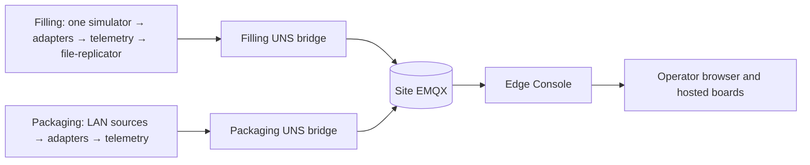

# EdgeCommons UNS — bottling-company E2E harness

The current full-system harness for the fictional Dallas bottling plant: field sources → OPC UA
and Modbus adapters → telemetry processing → file replication → device UNS bridges → site broker
→ Edge Console and hosted line boards. It is a public repository at
`edgecommons/bottling-company-test` and supersedes the older umbrella `system-test/` harness.

One container represents one device and runs its processes under supervisord against a local
EMQX broker. The images build from sibling source checkouts, so a run validates that recorded
workspace revision set. Historical build/browser/native-TV results are not fresh validation of
current sibling revisions.

The [Dallas line demo](https://docs.edgecommons.mbreissi.com/guides/dallas-line-demo/) walks the
scenario. See the [site guide](sites/dallas-site/README.md),
[filling simulator](sims/dallas-filling-sim/README.md),
[packaging Modbus simulator](sims/dallas-packaging-modbus/README.md) and
[scenario coordinator](sims/dallas-scenario-coordinator/README.md) for their own contracts.

## Authored inputs and generated configuration

`sites/dallas-site/definition.yaml` owns the topology and HOST/Greengrass/Kubernetes profiles.
Its `layers/` and `bindings/` provide config and environment values. The core CLI's `ec-deploy`
renderer generates the device catalogs, messaging/bootstrap configs and supervisor files.
`configs/lua/` contains authored scripts and is outside the generated output set.

Edit those inputs, then render from this repository root:

```bash
edgecommons deployment render sites/dallas-site/definition.yaml --env local --target HOST
```

Copy each node's output from `sites/dallas-site/render/host/<node>/` into its device config
and supervisor paths as described in the [site guide](sites/dallas-site/README.md#generated-configuration--do-not-hand-edit).
The `config-drift-gate` workflow checks these generated outputs. Hand-editing an output creates drift.
The CLI implementation/build instructions live in [core/cli](https://github.com/edgecommons/edgecommons/blob/main/cli/README.md).
The matching [Studio fixture traceability](https://github.com/edgecommons/deployment-studio/blob/main/fixtures/dallas/TRACEABILITY.md)
records the agreed Dallas contract; keep the fixture, harness inputs and renderer checks aligned.

## The container model — one device, many supervised processes

| Container (= device) | Thing | Supervised programs in start order | Field sources |
|---|---|---|---|
| `dallas-site` | `dallas-console` | EMQX → config-component → edge-console (3) | — |
| `dallas-filling-line` | `gw-fill-01` | EMQX → field-sim → config-component → uns-bridge → opcua-adapter + modbus-adapter → telemetry-processor → file-replicator (8) | One in-container Dallas simulator serves OPC UA and Modbus |
| `dallas-packaging-line` | `gw-pack-01` | EMQX → config-component → uns-bridge → opcua-adapter + modbus-adapter → telemetry-processor (6) | External KepWare and host Modbus sources |

These are 17 supervised programs; brokers and the simulator are not EdgeCommons components.
Both line devices use the same `edge-node` image with different mounted configs. Packaging runs
telemetry processing but does not start a simulator or file-replicator. Every device has its own
ConfigComponent. Each line's bridge relays its device bus into the site's broker; the console
is the sole browser-facing bus bridge.


```mermaid
flowchart LR
  F["Filling: one simulator → adapters → telemetry → file-replicator"] --> FB["Filling UNS bridge"]
  P["Packaging: LAN sources → adapters → telemetry"] --> PB["Packaging UNS bridge"]
  FB & PB --> SB[(Site EMQX)]
  SB --> C[Edge Console]
  C --> UI[Operator browser and hosted boards]
```

### Startup ordering & readiness gating

Supervisord priorities set start order, not readiness. `wait-for-tcp` gates launch on the local
broker and, for filling adapters, simulator ports. EMQX starts at priority 10, the filling
simulator at 20, ConfigComponent at 25, bridges at 28, adapters at 30, telemetry at 40 and
file-replicator at 50. Generated commands also include delays before config clients start.
`autorestart=true` handles process exits. Bridges retry the site connection themselves and do
not wait for the site broker before starting. Packaging catalogs are static rendered files;
startup does not substitute endpoint environment variables.

## Images (DRY)

Build context is the umbrella root (`../../..` from the site Compose file), allowing Docker to
copy sibling sources and use the local Rust dependency patch in `dockerfiles/cargo-sibling-patch.toml`.

- **`dockerfiles/edge-node.Dockerfile`:** Java 25 builds the local core and shaded OPC UA adapter;
  Rust builds telemetry-processor, file-replicator, uns-bridge and config-component. The runtime
  has JRE 25, EMQX, supervisord and Python. `/opt/pyenv` serves the Modbus adapter; a separate
  `/opt/simenv` pins the Dallas filling simulator's `pymodbus==3.6.9` dependency. That one simulator
  serves OPC UA `:4840` and Modbus `:5020` on loopback.
- **`dockerfiles/site.Dockerfile`:** Node 22 installs and builds the console `protocol` and `ui`
  workspaces. These do not require the TypeScript core, `link:lib` or a streamlog stub. Rust
  builds the gateway and ConfigComponent against sibling core sources. The Debian runtime
  serves `ui/dist` through the gateway's `webRoot`; no Vite/nginx process is required.

Rust binaries built on Debian Bookworm (glibc 2.36) run on the Noble edge-node base (glibc 2.39).
An older runtime glibc can make those binaries unloadable. EMQX is installed from its package
repository using the Dockerfiles' version argument; inspect available package versions if that
pinned package is unavailable.

### Build context & `.dockerignore`

The canonical `.dockerignore` has matching Dockerfile-specific copies under `dockerfiles/`.
They exclude build output, dependency caches and `.claude/` worktrees from the umbrella context,
while preserving source directories named `target`. Retained `streamlog-node-stub/` and old
packaging template helpers are historical support files, unused by the current site build and
rendered catalog startup path.

## Fresh setup

Clone this repository as a sibling of `core`, `config-component`, `edge-console`, `opcua-adapter`,
`modbus-adapter`, `telemetry-processor`, `file-replicator` and `uns-bridge`:

```bash
cd ~/source/edgecommons
git clone git@github.com:edgecommons/bottling-company-test.git
cd bottling-company-test
cp .env.example .env
```

Use compatible main revisions or an explicitly recorded integration branch set. The old
`chore/edgecommons-rebrand` branch is historical. `.env` is ignored and only the host binding
variables below affect Compose. Packaging endpoints are resolved from
`sites/dallas-site/bindings/local.json` when rendering; legacy endpoint/credential entries in
`.env.example` do not change the generated catalogs.

## Prerequisites

1. Docker with Compose v2.20+ (`include:` support) and BuildKit. The original harness was authored
   against Docker 28 / Compose v2.38; that is historical environment evidence.
2. The compatible sibling checkouts listed above. Images build against those local sources.
3. For packaging, LAN reachability to the KepWare and host Modbus endpoints selected in the
   bindings. The filling line and site node do not require those external sources.

## Run it

```bash
# Site and both line devices; packaging needs its external sources.
docker compose up -d --build
docker compose logs -f

# Or start only the self-contained filling line and site:
docker compose up -d --build dallas-site dallas-filling-line
```

Open **http://localhost:8080**. Use `docker compose logs -f dallas-filling-line`,
`dallas-packaging-line` or `dallas-site` to inspect one device's combined process log.

### What to watch in the console

1. **Overview:** the three devices, their ConfigComponents and the components in the table above.
   Healthy reachable components become FRESH through state keepalives.
2. **Signals:** adapter signals and each line's derived Availability, Performance, Quality and
   OEE values. Topics follow component/instance scope from their publishers.
3. **Events & Alarms / component detail Metrics:** adapter events and component health measures.
4. **Failure behavior:** an ungraceful bridge connection loss triggers its broker-published LWT
   and whole-device UNREACHABLE. A graceful shutdown may report STOPPED; `docker stop` is not a
   deterministic ungraceful-loss test. New state traffic recovers the device.

The bus carries protobuf envelopes. Browser and hosted-app WebSockets carry their separate native
JSON protocols; decoded envelope JSON is only a human-readable projection of the bus bytes.

### Inspect the pipeline output

```bash
docker compose exec dallas-filling-line ls -R /out/archive
ls -R replicated-output/
```

The filling telemetry pipeline finalizes Parquet files before file-replicator picks them up,
replicates them to `/mnt/replicated` (the host's `replicated-output/`) and moves the source to
`/out/_archived`. Telemetry and replication share an in-container filesystem. The OEE route
publishes derived values back to the bus for the console and boards.

### `.env` knobs

| Variable | Default | Meaning |
|---|---|---|
| `CONSOLE_HOST` | `0.0.0.0` | Host interface for UI/WS; use `127.0.0.1` for local-only access |
| `CONSOLE_PORT` | `8080` | Host UI/WS port → site container `:8443` |
| `SITE_BROKER_PORT` | `18830` | Site MQTT port → `:1883` |
| `FILL_BROKER_PORT` | `18831` | Filling MQTT port → `:1883` |
| `PACK_BROKER_PORT` | `18832` | Packaging MQTT port → `:1883` |
| `SITE_DASHBOARD_PORT` | `18084` | Site EMQX dashboard → `:18083` |

For a packaging source running on this host, select `host.docker.internal` and its port in
`bindings/local.json`, then render and copy the outputs. Compose declares that host mapping.

### Teardown

```bash
docker compose down
```

Replicated host output remains available for inspection after teardown.

## Structure & how to extend it

The root Compose file includes `sites/dallas-site/docker-compose.yml`. Included paths resolve
relative to the site file. Site-owned authored inputs are `definition.yaml`, `layers/`,
`bindings/` and `configs/lua/`; device configs and `supervisor/` are generated outputs.

To add another site, copy the site structure, edit its authored hierarchy, identities, components
and bindings, render its outputs, then give its Compose services/containers/hostnames and ports
unique values. Add the site Compose file to the root include list. Do not edit generated catalogs
as the source of a new site definition.

The commented enterprise-broker extension at the root is an architectural extension point;
multi-site upstream bridging is not provisioned by the current three-service Dallas stack.

## Note on hierarchical config semantics

Each device starts a local ConfigComponent. Other framework components load their effective
configuration with `-c CONFIG_COMPONENT`; the provider itself loads its bootstrap from `FILE`.
The hierarchy is `enterprise → site → line → device` for line nodes and
`enterprise → site → device` for the site node. Local messaging uses `localhost`, filling sources
use loopback, packaging sources use rendered bindings and line bridges target `dallas-site`.
Identity levels are declared in hierarchy rather than duplicated as message tags. Templates can
reference identity names such as `{enterprise}`, `{site}` and `{line}`.
